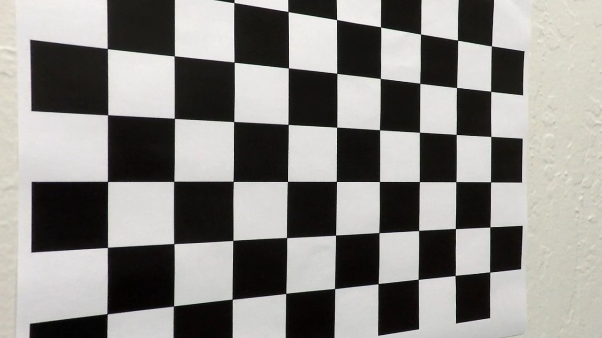
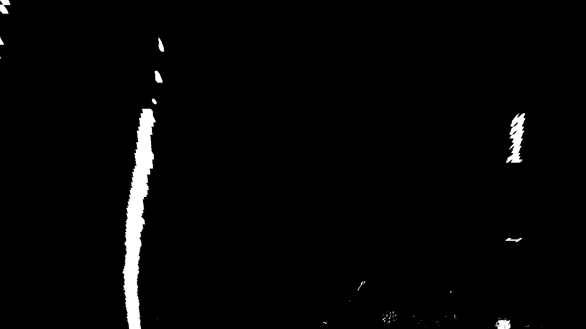

## Writeup

---

**Advanced Lane Finding Project**

The goals / steps of this project are the following:

* Compute the camera calibration matrix and distortion coefficients given a set of chessboard images.
* Apply a distortion correction to raw images.
* Use color transforms, gradients, etc., to create a thresholded binary image.
* Apply a perspective transform to rectify binary image ("birds-eye view").
* Detect lane pixels and fit to find the lane boundary.
* Determine the curvature of the lane and vehicle position with respect to center.
* Warp the detected lane boundaries back onto the original image.
* Output visual display of the lane boundaries and numerical estimation of lane curvature and vehicle position.

[//]: # (Image References)

[image1]: ./examples/undistort_output.png "Undistorted"
[image2]: ./test_images/test1.jpg "Road Transformed"
[image3]: ./examples/binary_combo_example.jpg "Binary Example"
[image4]: ./examples/warped_straight_lines.jpg "Warp Example"
[image5]: ./examples/color_fit_lines.jpg "Fit Visual"
[image6]: ./examples/example_output.jpg "Output"
[video1]: ./project_video.mp4 "Video"

## [Rubric](https://review.udacity.com/#!/rubrics/571/view) Points

### Here I will consider the rubric points individually and describe how I addressed each point in my implementation.  

---

### Camera Calibration

The code for this step is contained in the second code cell of the IPython notebook located in "Solution.ipynb".  

In order to use `cv2.calibrateCamera` function, I need to prepare "object points" and "image points".

* For "object points", they're the (x, y, z) coordinates of the chessboard corners in the world and z will always be 0 since the chessboard is in one plain. Here we have 9\*6 corners in the chessboard, so the top left corner will be (0,0,0) and the right bottom corner will be (8, 5, 0).
* For "image points", I use `cv2.findChessboardCorners` function on the gray scale chessboard image to find the corners automatically.

I create a class named `Camera`. After calling method `calibration`, it can hold the camera matrix and distortion coefficients. Then we can call method `undistort` to apply distortion correction to input image.

Here's the result for the ./camera_cal/calibration5.jpg.

Original Image             |  Undistorted Image
:-------------------------:|:-------------------------:
  |  


### Pipeline (single images)

#### 1. Provide an example of a distortion-corrected image.

Here's the result for the ./test_images/test1.jpg.

Original Image             |  Undistorted Image
:-------------------------:|:-------------------------:
  |  

#### 2. Describe how (and identify where in your code) you used color transforms, gradients or other methods to create a thresholded binary image.  Provide an example of a binary image result.

I used a combination of color transform and gradient threshold to generate a binary image. (`color_filter` in in "Solution.ipynb")

* Color transform: I convert the original image from BGR color space to HLS color space, and use S channel with threshold > 160.
* Gradient: I convert the original image to gray space, calculate the derivative on x direction, and use the threshold > 40.

Here's the binary image for the ./test_images/test1.jpg.

Undistorted Image             |  Binary Image
:-------------------------:|:-------------------------:
  |  

#### 3. Describe how (and identify where in your code) you performed a perspective transform and provide an example of a transformed image.

The code for perspective transform are wrapped inside a class named `PerspectiveTransformer`. Inside the constructor, I use ./test_images/straight_lines1.jpg to help me get the transform matrix and inverse transform matrix.

I chose the hardcode the source and destination points in the following manner:

| Source        | Destination   | 
|:-------------:|:-------------:| 
| 240, 686      | 240, 720      | 
| 576, 460      | 240, 0        |
| 704, 460      | 1040, 0       |
| 1040, 686     | 1040, 720     |

Here's the warpped image for the ./test_images/test1.jpg.

Binary Image               |  Perspective Transformed Image
:-------------------------:|:-------------------------:
  |  

#### 4. Describe how (and identify where in your code) you identified lane-line pixels and fit their positions with a polynomial?

The code for identifying lane-line pixels and fit polynomials for left and right lanes are in function `fit_lane_lines` in class `LineDetector`.

I use class `Line` to store some useful information detected in previous image frames.

* If there's no previous detection, I choose `leftx_base` and `rightx_base` based on histogram from the lower half of the binary image, and then apply sliding window algorithm to get potential left lane points and right lane points.
* If there's previsou detection, I'll only search points for the new line within +/- margin(100 pixel) around the old line center.

After I get the points for left lane and right line, I use `np.polyfit` function to help me fit two lines. Then I'll smooth the coeffients I get from the current fitting with previous fitting, if possible. The rule is current fiting contribute 10% and previous fitting contribute 90%. Code snippet is

```python
self.left_line.best_fit = 0.9*self.left_line.best_fit+0.1*self.left_line.current_fit
```

I'll use the smoothed coeffients everywhere. Here's the result for ./test_images/test1.jpg. Since it's single image detection, there's no previous detection in this case.


#### 5. Describe how (and identify where in your code) you calculated the radius of curvature of the lane and the position of the vehicle with respect to center.

The code for calculating the radius of curvature and vehicle position are in function `meature_curvature` in class `LineDetector`.

* For radius of curvature, I use the `ym_per_pix` and `xm_per_pix` provided by the class material to transform the points we have in the left and right lanes into real word space, and then fit polynomial again to get the new coeffients. After that, I can easily calculate based on formula provided by class material.
* For vehicle position with respect to center, I assume that our camera is located at the center of vehicle, so I can easily get the distance between image center pixel (y=y_max in the image) and left lane and right line respectively. Then I can get the vehicle position.

#### 6. Provide an example image of your result plotted back down onto the road such that the lane area is identified clearly.

The code for putting all required pieces together are in function `find_lane_lines` in class `LineDetector`.

Here's the result for ./test_images/test1.jpg.


---

### Pipeline (video)

#### 1. Provide a link to your final video output.  Your pipeline should perform reasonably well on the entire project video (wobbly lines are ok but no catastrophic failures that would cause the car to drive off the road!).

Here's a [link to my video result](./project_video_output.mp4)

---

### Discussion

#### 1. Briefly discuss any problems / issues you faced in your implementation of this project.  Where will your pipeline likely fail?  What could you do to make it more robust?

My solution cannot work well in challenge_video.mp4 and harder_challenge_video.mp4. I think the root cause would still be how to filter out lane line points precisely, especially when we have blurry lanes on the high way with changing sun light. I don't know how to handle the case that the lane line can hardly be seen by people, how can we make the machine to detect it.

The other possible improvement is to have better line fitting algorithm. I think there must be a way to tell the confidence about the lane lines we fit. For example, in the output image in step 4 above, the left fitted line is actually quite different from the right fitted line. I think the confidence in left line must be much higher than the right line, so we should probably discard the right lane we fit and use left lane coeffients to get a better right lane instead.
